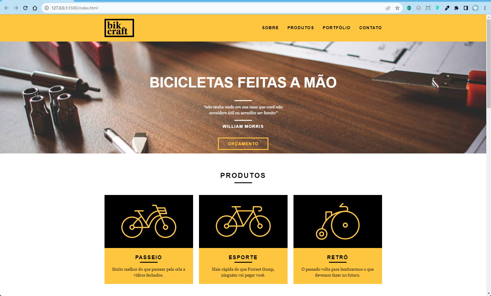
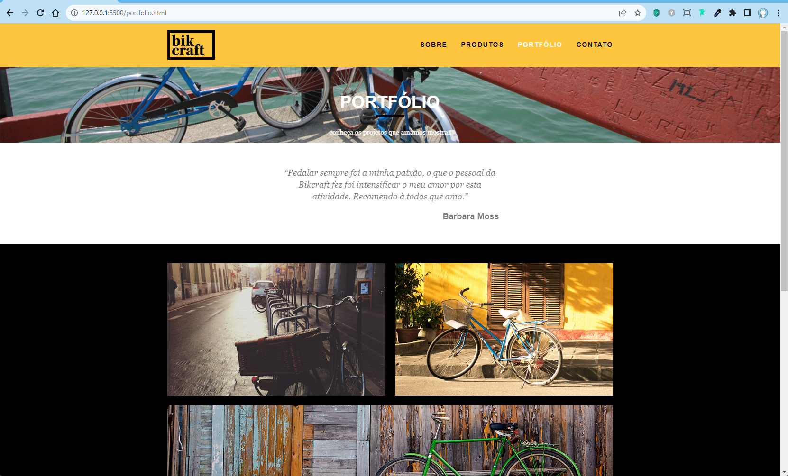
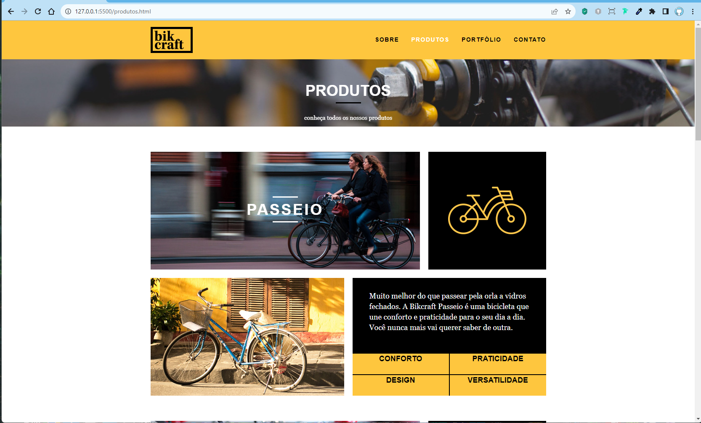
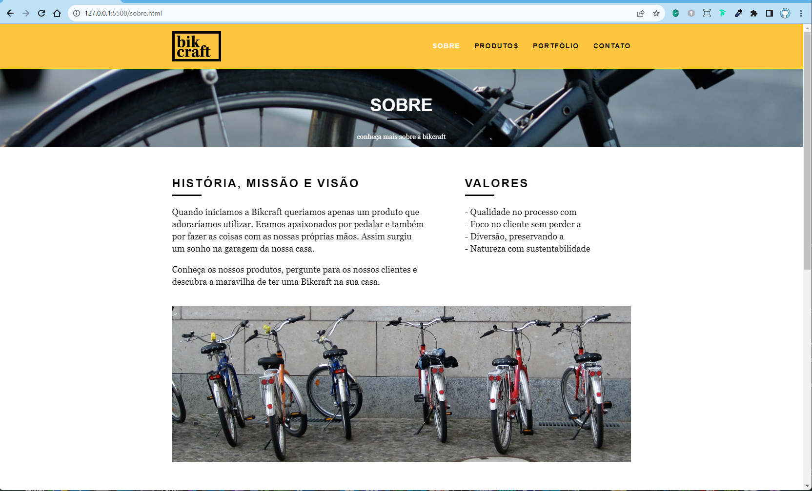
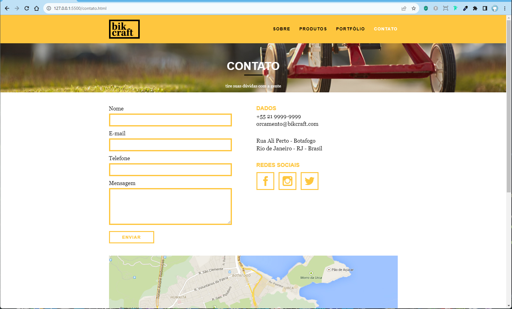
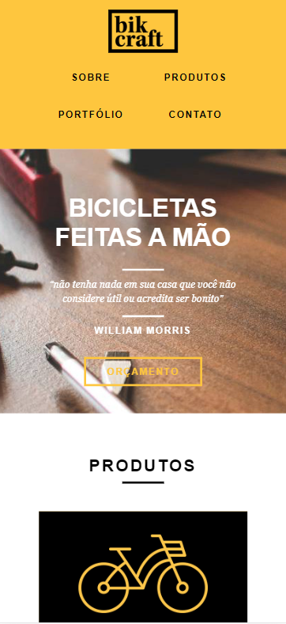
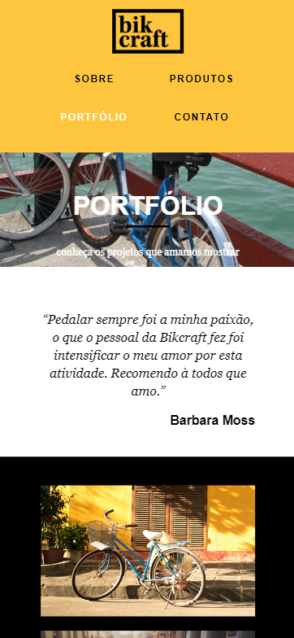
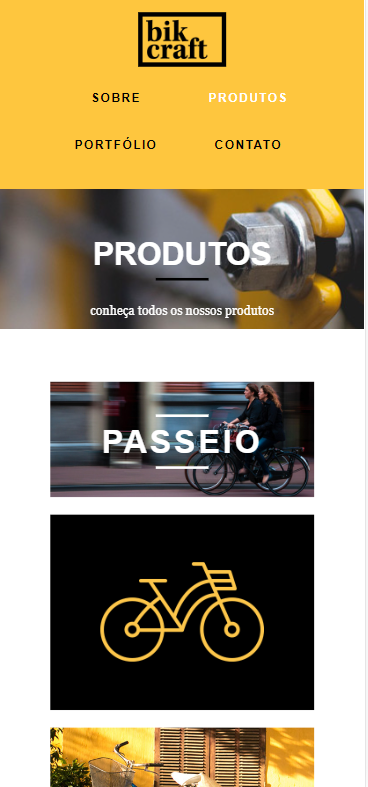
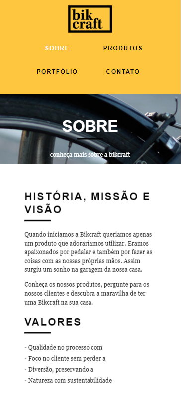

 
 

[Descrição](#--descrição-do-projeto-) |
[Funcionalidades](#%EF%B8%8F-funcionalidades) |
[Imagens](#-imagens-do-projeto-verão-web) |
[Tecnologias](#tecnologias-utilizadas-) |
[Como executar esse projeto ?](#%EF%B8%8F-como-executar-esse-projeto-) |
[Referências](#-referências-) |
[Autor](#-autor-) |

<h2> ✅ Descrição do Projeto: </h2> 

<h1 text-align="center"> 🌟Bikcraft-v1 com SASS🌟</h1> 

   Esse projeto faz parte do Curso de <i>CSS com SASS</i> da Origamid <https://origamid.com/>. Nesse curso Aprendida conceitos de SASS dentro do 02 projetos práticos o <strong>Bikcraft e o Lescone</strong> aplicando algumas técnicas como:

 

   💎 como criar variáveis no SASS 
   💎 Fazer @import de Arquivos 
   💎 Como criar mixins com SASS 
   💎 Criar funções com SASS 
   💎 como criar loop dentro do SASS  
   

 

> Nesse projeto Bikcraft em específico pegamos o projeto já pronto e foi feito a inclusão das técnicas de SASS dentro dele. 

 
 

<h2>📽️ de Demostração do Projeto</h2>

  <h2>⚙️ Funcionalidades</h2>

 Esse projeto simula uma loja de Bicicletas  onde podemos ver os  modelos de Bicicletas que a <strong>Bikcraft</strong> produz. e fazer um orçamento atráves de uma siolicitação via formulário 
  

 

 <h2>📸 Imagens do Projeto verão web.</h2>

> :bulb: **Dica:** Algumas imagens da versão Desktop.

 

 
 
   

 <h2>📱 Imagens do Projeto verão Mobile.</h2>

 > :bulb: **Dica:** Algumas imagens da versão Mobile.

 
 
 
 

<h2>🪛Tecnologias Utilizadas </h2>

✅HTML 
✅CSS 
✅JAVASCRIPT 
✅SASS  

 <h2>🛣️ Como Executar esse projeto ?</h2>

>> Pré Requisitos: 
Ter instaldo em seu computador: 
💾 - [node.js](https://nodejs.org/en) 
💾 - [vs-code](https://code.visualstudio.com/) 

1. Fazer a instalçao do **NODE.JS** _"Caso ainda não tenha em seu computador"_:
 
 [Node.Js](https://nodejs.org/en).  
 Clique no link☝️ acima e faça a instalação em seu computador.
  
  
---
2. Fazer o **fork** desse projeto para o seu Github. 

>Caso não saiba o que é isso ou como fazer um fork de um repositório vou deixar umn video aqui com o passo a passo de como fazer isso.
> https://www.youtube.com/watch?v=q-QTbNu8Ybc

---

3. Abra esse projeto dentro do seu **VScode**

---

4. Digite o comando dentro do terminal do **VSCode**

~~~~bash
npm install
~~~~

> Esse comando faz uma verificação de todas as Dependências necessária para a execução do projeto e faz a instalação dessas dependências para que você possa executar esse projeto. **Espere o processo ser concluido.** 

 

---

5. Agora digite o comando para a  *execução do SASS* dentro do terminal do **VScode** 

 

~~~~bash
npm run sass
~~~~

 

---

6. Pronto🏅 

> Vocé já tem o projeto dentro do seu github;  podendo verificar o código;  fazer alterações. etc... 

---

Para ter Acesso ao Projeto; clique no link Abaixo:   
> [Bikcraft ](https://bikcraft-woad.vercel.app/)

<h2> 📚Referências </h2>

> :memo: **Note:** [Origamid](https://origamid.com)

 <h2>👨🏻‍🦱 Autor </h2>
<h3> <a href="https://oliveira-portifolio.vercel.app/">Dev-Oliveira</a> </h3>
   
  
    
   
&copy; Todos os Direitos Reservados

<h1> 😁Obrigado por chegar até aqui!</h1>

